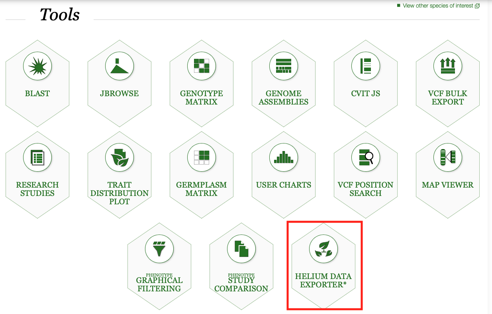

## Navigate to Helium Data Exporter

When you land on [KnowPulse](https://knowpulse.usask.ca/) homepage, scroll down to the Tool section and click on the [HELIUM DATA EXPORTER](https://knowpulse.usask.ca/helium-exporter) to access the Helium Data Exporter (please see image below). Alternatively, you can navigate to the Helium Data Exporter page directly by typing the address **knowpulse.usask.ca/helium-exporter** onto your browser's address bar.

* Helium Data Exporter requires additional permission to export data. Please contact the KnowPulse Team if you have no access to this tool.
## Download and install Helium Pedigree Visualization Framework

To visualize pedigree and categorical data generated by Helium Data Exporter, you will first need to install Helium Pedigree Visualization Application on your local computer. Helium Data Exporter interface contains a graphical setup guide to assist
you through the process of installing Helium (short for Helium Pedigree Visualization Application). In addition, all pertinent links to get you started are also outlined in the guide, including links to download a Helium version that is compatible to your operating system (OS) in use.

Please note for Mac OS user that your system will notify you upon installation about potential safety issue since Helium is not obtained through Apple store. This can be bypassed by pressing CTR key when clicking Open button (install) when prompted.

The image below is the top section of Helium Data Exporter interface showing a brief summary of Helium Pedigree Visualization and a graphical quick step by step guide on how to visualize pedigree and categorical data using Helium. 

