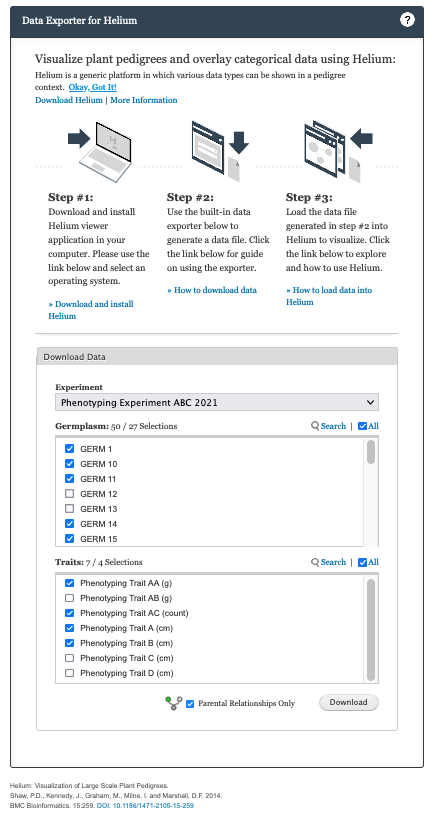

## How to download and install Helium 

To use Helium Data Exporter, you will need to install Helium on your local computer. Follow the setup guide to  [Download and install Helium](https://github.com/cardinalb/helium-docs/wiki/Download-Helium)

