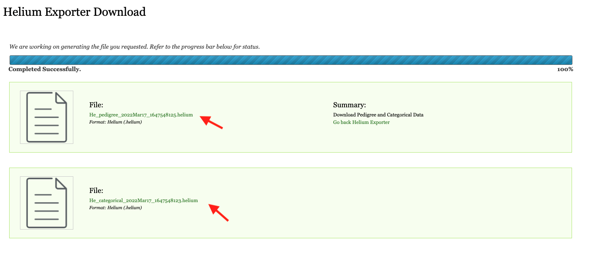

## How to download your pedigree and categorical data 

Pedigree and categorical data from your registered experiment(s) can be downloaded from [Helium Exporter module](https://knowpulse.usask.ca/helium-exporter)(requires log in to access).

1. Select an experiment of your interest from the **Experiment** selector. You have to the user of an experiment before you can access the data under it.
 
2. The next section is the **Germplasm/lines selector with search functionality**.  In this section, on your left hand side, there is a germplasm field button. In the screenshot for example, there are 50 germplasms available and we are insterested in the 27 of them. On your right hand side, in the field control, you can either use **Search** to look for a specific germplasm from the field, or click on **All** to select the full dataset. 

[Missing screenshot]

3. Followed by the germplasm section is the the **Trait/categorical data selector with search functionality**. Again, on your left hand side, there is a trait search field button. From the screenshot example, there are ### traits available for your to view. On your right hand side, in the field control, you can either use **Search** to look for a specific trait from the field, or click on **All** to select all the available traits.

4. Below the **Trait** section, there is an additional filter called **Parental Relationships Only** for you to choose to view only the maternal and parental relationships. 

[Missing screenshot]

5. Finally, click on the **Download** button to sumbit your request. Helium from there will reture the files for you. One is a pedigree file, the other is a categorical file. Downloaded results can be cross checked in a .txt file when you choose to open it in a new window tab [Need help from Reynold].
[Missing screenshot]
 Click on both files to save them onto your local computer. In the next episode, we will learn how to export these two files into your Helium Exporter.

