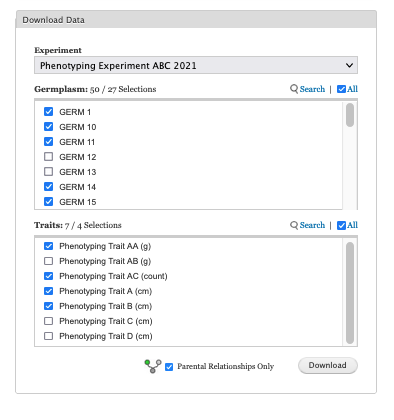

## Select an experiment, germplasm, and trait

You can export pedigree and categorical data using Helium Data Exporter for visualization using Helium in the following steps.

Please note that you can only export data from experiments that you have permission to. Other experiments that you wish to download data from can be arranged by contacting KnowPulse.

This guide assumes that you have obtained a copy of Helium that matches your operating system and that you have correctly installed the software in your computer. **Please see Episode 1**.

### Step 1 
Select an experiment of interest from the Experiment selector dropdown field. Experiments shown in this field are only the experiments assigned to your account in KnowPulse. Please contact us to gain permission to other experiments available in KnowPulse.

When an experiment is selected, germplasm and trait fields repopulate with experiment-specific germplasm and trait options that you can select.

### Step 2
Select or deselect GERMPLASM by clicking the checkbox for each option. Use inline field controls to search specific option or to select/deselect all options.

### Step 3
Select or deselect TRAIT by clicking the checkbox for each option. Use inline field controls to search specific option or to select/deselect all options.

### Step 4
Select germplasm relationship type to return by checking Parental Relationships Only checkbox. This is field is unchecked by default and will return all germplasm relationships types (ie. line is a selection of, line is a cultivar of etc.) in addition to parental relationships (Male and Female parents of a line). By checking this option, only parental relationships of a line will be returned.

### Step 5 
Click Download button to submit your request. The exporter will gather all datapoints that matched your criteria and will generate the required data files.

### Example 
The screenshot of Helium Data Exporter form field elements showing 50 germplasms available with the 27 out 50 lines selected (checked). On the right hand side of each field, are field controls search and select/deselect all checkbox. You can use **Search** to look up for specific germplasm from the field and click on **All** to select the full dataset.

## Download

Helium Data Exporter will generate two tab-separated-value files namely, **pedigree data file** and **categorical data file**. Each data file will have **.helium** extension to correspond the file to Helium Pedigree Visualization program in your computer. Both files are generated simultaneously with progress being reported to user by a graphical progress bar. These two data files can be saved when enabled onto your local computer and can be loaded to Helium for visualization.

We will talk more about visualization details in the next episode.
