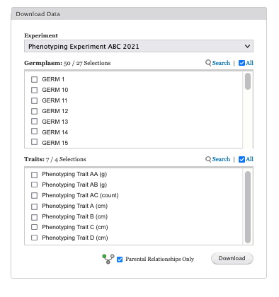

## Select an experiment, germplasm, and trait

You can export pedigree and categorical data using Helium Data Exporter for visualization using Helium in the following steps.

Please note that you can only export data from experiments that you have permission to. Other experiments that you wish to download data from can be arranged by contacting KnowPulse.

This guide assumes that you have obtained a copy of Helium that matches your operating system and that you have correctly installed the software in your computer. Please see Episode 1 (Helium setup guide).

### Step 1 

Select an experiment of interest from the Experiment selector dropdown field.Experiments shown in this field are only the experiments assigned to your account in KnowPulse. Please contact us to gain permission to other experiments available in KnowPulse.

When an experiment is selected, germplasm and trait fields repopulate with experiment-specific germplasm and trait options that you can select.

### Step 2
 
2. Then choose the germplasm of your interest from **Germplasm/lines selector with search functionality**.  From here, on your left hand side, checkboxes allow you to choose the desired germplasm. Germplasm field supports an inline search for specific germplasm. In the below screenshot, for example, there are 50 germplasms available and we are insterested in 27 of them. On your right hand side, in the field control, you can either use **Search** to look up for specific germplasm from the field, or click on **All** to select the full dataset. 

3. Followed by the germplasm section is the **Trait/categorical data selector with search functionality**. Again, on your left hand side, there is a trait search field that supports inline search for any traits of interest. On your right hand side, in the field control, you can either use **Search** to look up a specific trait from the field, or click on **All** to select all the available traits.

4. Below the **Trait**, there is an additional filter called **Parental Relationships Only**. Click on it allows you to choose only the maternal and parental relationships of the germplasm, therefore, only male and female parents of a line are returned. 

5. Finally, click on the **Download** button to submit your request. 

## Download your pedigree and categorical data files

Helium from there will return you two tab-separated-value files, with the extension name of .helium. One is for pedigree data, the other is for categorical data. It may take the exporter a few seconds to generate the files for you. Those two files can be saved onto your local computer, followed by loaded to Helium for visualization. We will talk more visualization details in the next episode.

