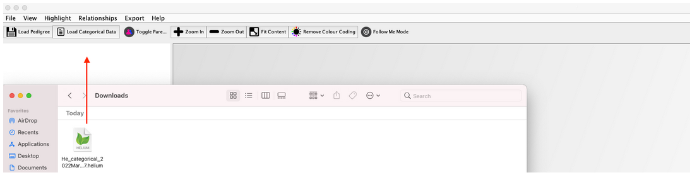

## How to select a specific experiment, germplasm, and trait

Pedigree and categorical data from your registered experiment(s) can be downloaded from [Helium Exporter module](https://knowpulse.usask.ca/helium-exporter)(requires log in to access).

1. Select an experiment of your interest from the **Experiment** selector. You have to be the user of an experiment before you can access any data under it.
 
2. The next field is the **Germplasm/lines selector with search functionality**.  From here, on your left hand side, there is a germplasm field button. Germplasm filed supports inline search for a specific germplasm. In the below screenshot, for example, there are 50 germplasms available and we are insterested in the 27 of them. On your right hand side, in the field control, you can either use **Search** to look for a specific germplasm from the field, or click on **All** to select the full dataset. 

3. Followed by the germplasm section is the the **Trait/categorical data selector with search functionality**. Again, on your left hand side, there is a trait search field supports inline search for a specific trait. In the screenshot, there are 7 traits and we are interested in 4 of them. On your right hand side, in the field control, you can either use **Search** to look for a specific trait from the field, or click on **All** to select all the available traits.

4. Below the **Trait**, there is an additional filter called **Parental Relationships Only** for you to choose to view only the maternal and parental relationships, which means only male and female parents of a line are returned. 

5. Finally, click on the **Download** button to sumbit your request. 

## How to download your pedigree and categorical data

Helium from there will return two files for you. One is for pedigree data, the other is for categorical data. Those two files can be saved onto your local computer, followed by load to Helium for visualization.

## Load your data into Helium Exporter

1. Open the Helium Exporter from your local computer. 

2. First, let us upload the pedigree file from your local computer into Helium Exporter from the Overview Panel for visualization. [Add more description based on screenshot]

 Pedigree file allows you to view pedigree relationship between germplasm in Main Pedigree Visualization Panel.
[Missing demo screenshot]

3. Then, let us repeat the same step with categorical file to view the traits.

