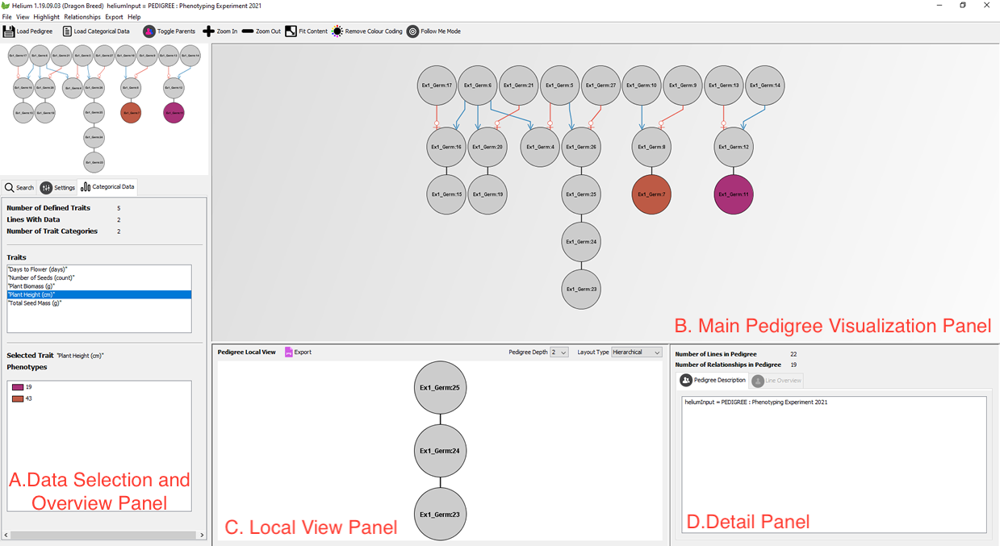

## How to visualize your data with Helium Exporter

As shown in the below screenshot, your console can be divided into four main panels.

Categorical file allows you to view traits in both Data Selection Overview Panel and Detail Panel. 

### A. Data Selection and Overview Panel

Zoom in or zoom out on the top part of Panel A to see the relationship details of any germplasm of interest, enlarged relationship details can be find in Panel B. Use **Search** feature to look up a spevific germplasm. You can also apply customize settings in panel A for your visualization.

### C. Local View Panel 

Use pedigree depth function to select the pedigree depth, as well as using export function to get a high-quality .png file. 

### D. Detail Panel

Click on **Line Overview** to view trait details of the selected germplasm from panel C
